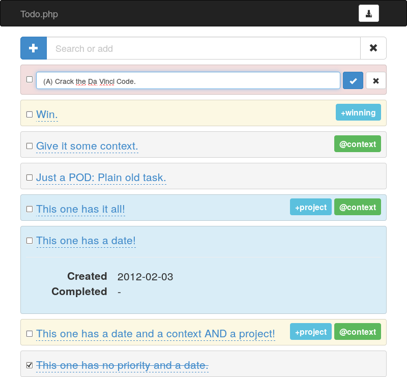

# todo.webapp

Webapp for [todo.txt](http://todotxt.com/).

## Installation

Before, you need the [REST API](https://github.com/sanpii/todo.rest).

    $ git clone git@github.com:sanpii/todo.webapp.git
    $ cd todo.webapp
    $ php composer.phar install

For development purpose only:

    $ cp web/js/config/{development,current}.js
    $ php -S localhost:8081 -t web/ 2> /dev/null &
